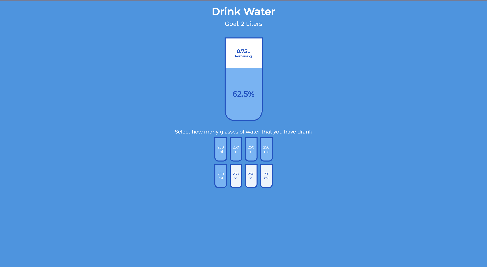

# 50 Projects in 50 Days - Drink Water

This is a code along project in the [50 Projects In 50 Days - HTML, CSS & JavaScript Udemy Course](https://www.udemy.com/course/50-projects-50-days/). Sharpen your skills by building 50 quick, unique & fun mini projects.

## Table of contents 😌

- [Overview](#overview)
  - [The project](#the-project)
  - [Screenshot](#screenshot)
  - [Links](#links)
- [My process](#my-process)
  - [Built with](#built-with)
  - [What I learned](#what-i-learned)
  - [Continued development](#continued-development)
  - [Code snippets](#im-really-proud-of-these-code-snippets%EF%B8%8F)
  - [Useful resources](#useful-resources)
- [Author](#author)
- [Acknowledgments](#acknowledgments)

## Overview👋🏾

Welcome to the 16<sup>th</sup> mini-project of the course!

### The project😥

In this project users will be able to:

- Build a responsive site that displays a functional progress bar.

### Screenshot🌇



### Links👩🏾‍💻

- Live Site URL: (https://tubular-caramel-63daaf.netlify.app/)

## My process💭

This is a more complex project that I started by marking out initial structure,classes, and id's in HTML. Next I began styling the css by styling the cups, the remained, percentage classes. I then added functionality by way of JavaScript to switch count how many small cups were filled and use this result to determine the percentage of how much water was drank and how much the user has left to consume. I also added a feature that allows the user to uncheck a cup while keeping those that appear in the queue before it to stay selected.

### Built with👷🏾‍♀️

- Semantic HTML5 markup
- CSS custom properties
- Flexbox
- JavaScript

### What I learned👩🏾‍🏫

I learned how to use the nextElementSibling property to access the element immediately following the selected one in the parent list. I used this to add the feature where the user can deselect a cup yet allows for the previously selected cups to continue to show as full.

### Continued development🔮

In the future I plan on continuing to practice using inline styling in JavaScript to style CSS elements.

I also plan on advancing the skill of declaring global CSS variables to the root element.

I also plan on continuing to learn the best ways to phrase git commits, so that future viewers can fully understand the changes that have occurred.

### I'm really proud of these code snippets✂️

```js
smallCups.forEach((cup, idx2) => {
  if (idx2 <= idx) {
    cup.classList.add('full');
  } else {
    cup.classList.remove('full');
  }
});

if (fullCups === 0) {
  percentage.style.visibility = 'hidden';
  percentage.style.height = 0;
} else {
  percentage.style.visibility = 'visible';
  percentage.style.height = `${(fullCups / totalCups) * 330}px`;
  percentage.innerText = `${(fullCups / totalCups) * 100}%`;
}

if (fullCups === totalCups) {
  remained.style.visibility = 'hidden';
  remained.style.height = 0;
} else {
  remained.style.visibility = 'visible';
  liters.innerText = `${2 - (250 * fullCups) / 1000}L`;
}
```

### Useful resources📖

- [Resource 1](https://developer.mozilla.org/en-US/docs/Web/API/Element/nextElementSibling) - This is an article details the nextElementSibling Property. I'd recommend it to anyone still learning this concept.

## Author🔎

- Website - [Portfolio Site](https://www.maiannethornton.com/Portfolio/index.html)
- Frontend Mentor - [@MaianneThornton](https://www.frontendmentor.io/profile/MaianneThornton)
- GitHub - [@MaianneThornton](GitHub.com/MaianneThornton)
- Twitter - [@MaianneThornton](https://twitter.com/MaianneThornton)
- LinkedIn - [@MaianneThornton](https://www.linkedin.com/in/maiannethornton/)

## Acknowledgments🙏🏾

Special Thanks go to [Brad Traversy](http://www.traversymedia.com/) and [Florin Pop](http://www.florin-pop.com/) creating the course and making reviewing concepts fun 😊.
